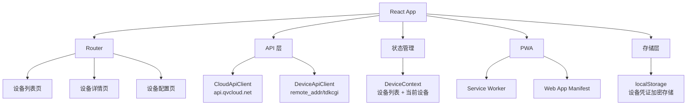

## 产品概述

基于 QV IoT 设备协议文档，开发一个移动端优先的 PWA 视频监控管理应用。用户可以通过手机浏览器添加到桌面，像原生应用一样管理 IoT 摄像头设备。

## 用户需求

- **目标平台**：移动端优先（手机浏览器添加到桌面使用）
- **视频流方式**：仅获取 RTSP 地址并展示给用户，用户自行用 ffplay/VLC 等工具播放
- **UI 风格**：Material-UI（Google Material Design 风格）
- **一期核心功能**：设备认证与连接管理、设备状态查询与配置

## 核心功能

- **设备连接管理**：输入 api_key_id / api_key_secret 和设备 ID，通过 QV 云平台获取设备授权地址（remote_addr），支持多设备管理
- **实时监控 RTSP 地址获取**：通过 /dev_exe_cmd 接口（port=554）获取 RTSP 授权地址，展示 RTSP URL 供用户复制或通过 ffplay/VLC 播放
- **设备状态总览**：调用 get.device.status 获取设备完整状态（系统信息、网络、WiFi、TF卡、通道状态等），以卡片形式可视化展示
- **设备信息查看**：查看 MAC、型号、固件版本、云 ID 等基本信息
- **设备配置修改**：
- 时间设置（get/set.product.time）
- 图像翻转（get/set.image.flip）
- 音量调节（get/set.audio.outvolume）
- 网络配置（get/set.network.config）
- 帧率模式（get/set.fps.mode）
- 报警配置（get/set.alarm.detailInfo）
- 录像配置（get/set.record.config、get/set.record.schedule）
- **设备操作**：重启设备、恢复出厂设置（需二次确认）
- **PWA 特性**：可安装到手机桌面、离线缓存静态资源、响应式移动端适配

## 技术栈

- **前端框架**：React 18 + TypeScript
- **构建工具**：Vite 6（内置 PWA 插件 vite-plugin-pwa）
- **UI 组件库**：Material-UI (MUI) v6
- **路由**：React Router v6
- **状态管理**：React Context + useReducer（轻量级，无需 Redux）
- **HTTP 请求**：Axios
- **PWA**：vite-plugin-pwa + Workbox（自动生成 Service Worker）
- **数据持久化**：localStorage（存储设备列表和凭证）
- **图标**：@mui/icons-material

## 实现方案

### 整体策略

采用**纯前端架构**，所有 API 调用直接从浏览器发起。设备 CGI 命令通过 remote_addr（由云平台 API 获取的映射地址）直接发送到设备，云平台认证 API 调用 api.qvcloud.net。

### 关键技术决策

1. **RTSP 地址展示而非播放**：浏览器无法直接播放 RTSP，因此仅获取地址后以文本形式展示，提供一键复制功能，并附上使用提示
2. **API 客户端分层**：封装两层 HTTP 客户端 —— `CloudApiClient`（调用 QV 云平台）和 `DeviceApiClient`（调用设备 CGI），前者获取的 remote_addr 作为后者的基础地址
3. **双格式请求处理**：设备 CGI 接口部分使用 XML（旧协议），部分使用 JSON（新协议），需封装统一的请求/响应解析器
4. **安全考量**：api_key_secret 和设备密码存储在 localStorage，通过 AES 加密存储；生产环境应使用 HTTPS

### 数据流

```
用户输入 api_key_id/api_key_secret + devid
  → CloudApiClient.getAuthorizationAddress(port)
  → 获得 remote_addr（映射地址）
  → DeviceApiClient(remote_addr) 初始化
  → 调用 get.device.status / get.product.info 等
  → 数据渲染到 UI
```

### 架构设计



## 目录结构

```
cloudAPi_demo/
├── QV_IOT_Device_Protocol_en.md          # [EXISTING] API 协议文档
├── index.html                            # [NEW] PWA 入口 HTML
├── vite.config.ts                        # [NEW] Vite 配置（含 PWA 插件）
├── tsconfig.json                         # [NEW] TypeScript 配置
├── package.json                          # [NEW] 项目依赖
├── public/
│   ├── manifest.json                     # [NEW] PWA 应用清单
│   ├── icons/                            # [NEW] PWA 图标目录
│   │   ├── icon-192x192.png
│   │   └── icon-512x512.png
│   └── favicon.ico
├── src/
│   ├── main.tsx                          # [NEW] 应用入口
│   ├── App.tsx                           # [NEW] 根组件（路由 + Provider）
│   ├── theme.ts                          # [NEW] MUI 自定义主题配置
│   ├── vite-env.d.ts                     # [NEW] Vite 类型声明
│   ├── api/
│   │   ├── cloud-api.ts                  # [NEW] QV 云平台 API 客户端（认证、获取授权地址）
│   │   ├── device-api.ts                 # [NEW] 设备 CGI API 客户端（所有 HTTP 命令）
│   │   └── rtsp-helper.ts                # [NEW] RTSP URL 构建工具
│   ├── hooks/
│   │   ├── useDevices.ts                 # [NEW] 设备列表 CRUD（localStorage 持久化）
│   │   └── useDeviceStatus.ts            # [NEW] 设备状态轮询 hook
│   ├── context/
│   │   └── DeviceContext.tsx              # [NEW] 设备全局状态 Context
│   ├── types/
│   │   ├── device.ts                     # [NEW] 设备相关类型定义
│   │   └── api.ts                        # [NEW] API 请求/响应类型定义
│   ├── pages/
│   │   ├── DeviceListPage.tsx            # [NEW] 设备列表页（添加/删除设备）
│   │   ├── DeviceDetailPage.tsx          # [NEW] 设备详情页（状态总览 + RTSP 地址）
│   │   ├── DeviceConfigPage.tsx          # [NEW] 设备配置页（分类配置面板）
│   │   └── AddDeviceDialog.tsx           # [NEW] 添加设备弹窗
│   ├── components/
│   │   ├── DeviceCard.tsx                # [NEW] 设备卡片组件
│   │   ├── StatusCard.tsx                # [NEW] 状态信息卡片
│   │   ├── RtspUrlCard.tsx               # [NEW] RTSP 地址展示组件（含复制按钮）
│   │   ├── ConfigSection.tsx             # [NEW] 通用配置区块组件
│   │   ├── ScheduleEditor.tsx            # [NEW] 录像计划编辑器（周日程表）
│   │   └── ConfirmDialog.tsx             # [NEW] 危险操作确认弹窗
│   └── utils/
│       ├── storage.ts                    # [NEW] localStorage 加密存储工具
│       └── xml-parser.ts                 # [NEW] XML 请求构建与响应解析工具
```

## 实现注意事项

- **双格式处理**：设备 API 同时存在 XML 和 JSON 两种 Content-Type，device-api.ts 需根据 command 类型自动选择正确的格式化方式
- **CORS 问题**：设备 CGI 接口可能不支持浏览器跨域请求，需做好降级处理和错误提示；云平台 API 也需确认 CORS 策略
- **凭证安全**：api_key_secret 和设备密码在 localStorage 中需 Base64 或简单加密存储，避免明文
- **错误处理**：API 返回 code 非 0 时需统一展示错误信息（errTip 字段），网络超时需友好提示
- **PWA 配置**：vite-plugin-pwa 配置 registerType: 'autoUpdate'，确保离线时静态资源可用
- **移动端适配**：使用 MUI 的 responsive 断点系统，所有页面以 mobile-first 设计

## 设计风格

采用 Material Design 3 风格，以深蓝色为主色调，搭配科技感的深色背景，营造专业的安防监控氛围。移动端优先设计，底部导航栏切换核心页面。

## 页面规划（4 页）

### 1. 设备列表页（首页）

- **顶部栏**：应用标题 "QV 监控" + 添加设备按钮
- **设备卡片列表**：每个卡片显示设备名称、型号、在线状态指示灯、最后连接时间
- **空状态**：首次使用时显示引导添加设备的提示
- **底部导航栏**：设备列表 / 消息中心 / 设置

### 2. 设备详情页

- **顶部栏**：返回按钮 + 设备名称 + 更多操作菜单（重启/恢复出厂）
- **状态概览区块**：固件版本、MAC 地址、在线时长、TF 卡状态卡片
- **网络状态卡片**：WiFi 名称、信号强度、IP 地址
- **RTSP 地址卡片**：展示实时监控 RTSP URL，带一键复制按钮和使用说明
- **快捷操作入口**：点击跳转到对应配置页

### 3. 设备配置页

- **顶部栏**：返回按钮 + "设备配置"
- **配置分组列表**：
- 时间设置（时区、当前时间）
- 图像设置（翻转开关）
- 音频设置（通话音量、提示音量滑块）
- 网络设置（DHCP/静态IP、IP地址、网关等）
- 视频设置（帧率模式选择）
- 报警设置（移动检测开关、灵敏度）
- 录像设置（录像计划周日程表编辑器）

### 4. 添加设备弹窗

- **表单字段**：api_key_id、api_key_secret（密码输入）、设备 ID
- **连接测试按钮**：测试连接是否成功
- **保存按钮**：添加到设备列表

## Agent Extensions

No extensions needed for this implementation task.