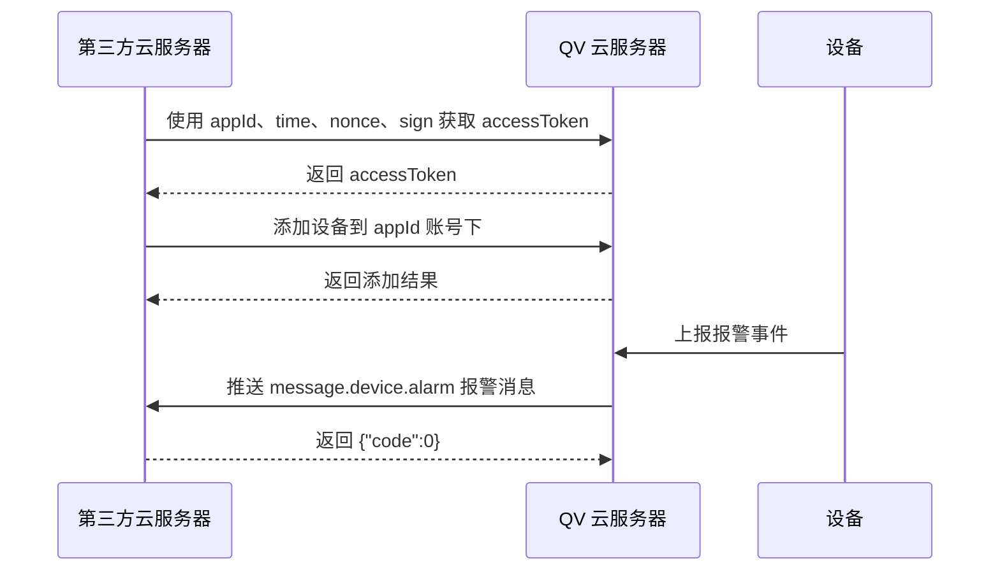

# QV 云报警开放接口对接技术文档

## 1. 文档目的

本文档用于指导第三方云服务器接入 QV 云服务器的设备报警能力。第三方完成接入后，可通过 QV 分配的 `appId` 获取认证权限，将需要接收报警的设备添加到指定账号下；同时，协议也支持托管设备消息和取消托管设备消息。

本文档主要说明两部分内容：

1. `appId` 账号与设备的关联关系：包括认证、设备添加、设备查询、设备删除，以及托管设备关系。
2. 报警信息推送：设备与 `appId` 建立添加或托管关系后，QV 云服务器向第三方服务器推送设备报警信息，第三方服务器需要自行保存报警数据。

## 2. 基本概念

| 名称 | 说明 |
| --- | --- |
| QV 云服务器 | QV 提供的云平台，负责认证、设备关系管理和报警消息推送。 |
| 第三方云服务器 | 客户自有服务器，调用 QV OpenAPI 管理设备，并接收 QV 推送的报警消息。 |
| appId | QV 分配的应用标识。一个 `appId` 可理解为一个账号，由 QV 提供，不支持第三方自行注册。 |
| appSecret | QV 分配的应用密钥，用于计算认证签名。第三方应妥善保管，不应下发到客户端。 |
| accessToken | 第三方通过认证接口获取的访问令牌，用于调用设备管理接口。 |
| deviceId | 设备云 ID，也可称为 DUID，用于唯一标识一台设备。 |
| 添加设备 | 第三方将设备绑定到当前 `appId` 账号下。绑定成功后，该 `appId` 可接收该设备报警。 |
| 托管设备 | QV 云服务器向第三方服务器推送的托管设备列表消息，命令字为 `message.device.managed`。 |

## 3. 接入前准备

第三方接入前需向 QV 获取以下信息：

| 配置项 | 说明 |
| --- | --- |
| `appId` | QV 分配的应用标识。 |
| `appSecret` | QV 分配的签名密钥。 |
| OpenAPI 服务地址 | QV 云 OpenAPI 的域名或 IP，由 QV 提供。 |
| 报警推送回调地址 | 第三方提供给 QV 的 HTTP 接口地址，用于接收报警、托管、取消托管消息。 |

第三方服务器需要提供 HTTP 接口，用于接收 QV 云服务器推送的报警、托管和取消托管消息。推送消息请求体为 JSON。

## 4. 整体接入流程



托管设备场景下，QV 云服务器会向第三方服务器推送 `message.device.managed` 托管通知；取消托管时推送 `message.device.cancelManaged` 通知。

## 5. 认证机制

### 5.1 获取访问令牌

**接口地址**

```http
POST /cloudweb/openapi/v1/user/token
```

**Content-Type**

```http
application/json
```

**请求参数**

| 字段 | 类型 | 必填 | 说明 |
| --- | --- | --- | --- |
| `appId` | string | 是 | QV 分配的应用标识。 |
| `sign` | string | 是 | 应用签名，用于身份验证。 |
| `time` | number | 是 | 请求时间戳。原始资料字段说明为毫秒，示例值为 `1777516761`。实际联调单位以 QV 方确认为准。 |
| `nonce` | string | 是 | 随机字符串，用于防重放。 |
| `id` | string | 是 | 请求标识，响应中原样返回。 |

**签名计算方式**

将 `time`、`nonce`、`appSecret` 按以下格式拼接后计算 SHA-256：

```javascript
function calcSignSha256(time, nonce, appSecret) {
  const str = "time:" + time + ",nonce:" + nonce + ",appSecret:" + appSecret;
  return CryptoJS.SHA256(str).toString();
}
```

**请求示例**

```json
{
  "appId": "R001Gh4qy0qSwxY9JfbNGYhwCp5g",
  "sign": "0a3b38b43c23b77f22e4f14b8f8e62d5f164b2bd62fb88626a6b5a4d923d5817",
  "time": 1777516761,
  "nonce": "20nryewobnf",
  "id": "req-001"
}
```

**成功响应示例**

```json
{
  "result": 0,
  "url": "/token",
  "message": "Success",
  "data": {
    "accessToken": "At_a1b2c3d4e5f6...",
    "expireTime": 7200
  },
  "id": "req-001"
}
```

**错误响应示例（参数缺失）**

```json
{
  "result": 2,
  "url": "/token",
  "message": "Param error",
  "data": null,
  "id": "0"
}
```

**错误响应示例（签名验证失败）**

```json
{
  "result": 1000001,
  "url": "/token",
  "message": "xxxx",
  "data": null,
  "id": "req-001"
}
```

后续设备管理接口均需要携带 `token` 和 `appId`。其中 `token` 为本接口返回的 `accessToken`。

## 6. APPID 与设备关系

### 6.1 关系说明

一个 `appId` 代表一个 QV 分配的账号。设备与 `appId` 建立关系后，该 `appId` 才能接收设备报警。

设备与 `appId` 的关系有两种：

| 关系类型 | 建立方式 | 是否可接收报警 | 说明 |
| --- | --- | --- | --- |
| 添加关系 | 第三方调用添加设备接口，将设备绑定到当前 `appId`。 | 是 | 适用于第三方直接管理设备的场景。 |
| 托管关系 | QV 云服务器推送托管设备消息。 | 是 | 对应消息命令字为 `message.device.managed`。 |

只要设备与 `appId` 建立添加或托管关系，设备产生报警后，QV 云服务器就会向第三方服务器推送报警信息。

### 6.2 设备管理接口公共参数

设备管理接口的基础路径为：

```http
/cloudweb/openapi/v1/device
```

所有设备管理接口均为 `POST` 请求，`Content-Type` 为 `application/json`。

公共必填字段如下：

| 字段 | 类型 | 必填 | 说明 |
| --- | --- | --- | --- |
| `token` | string | 是 | 通过认证接口获取的 `accessToken`。 |
| `appId` | string | 是 | QV 分配的应用标识，需与获取 token 时使用的 `appId` 一致。 |

认证失败时，接口返回错误码 `1000002`。

### 6.3 添加设备

将设备绑定到当前 `appId` 账号下。绑定成功后，该 `appId` 可接收该设备的报警消息。

**接口地址**

```http
POST /cloudweb/openapi/v1/device/add
```

**请求参数**

| 字段 | 类型 | 必填 | 说明 |
| --- | --- | --- | --- |
| `token` | string | 是 | 访问令牌。 |
| `appId` | string | 是 | 当前账号对应的应用标识。 |
| `deviceId` | string | 是 | 设备云 ID / DUID。 |
| `deviceName` | string | 是 | 设备名称。 |
| `authCode` | string | 是 | 设备验证码。 |
| `id` | string | 否 | 请求标识，响应中原样返回。 |

**请求示例**

```json
{
  "token": "At_a1b2c3d4e5f6...",
  "appId": "xxxxxxxxxxxxxxxxxxxxxxx",
  "deviceId": "DEVICE001",
  "deviceName": "客厅摄像头",
  "authCode": "123456",
  "id": "req-003"
}
```

**成功响应示例**

```json
{
  "result": 0,
  "url": "/add",
  "message": "Success",
  "data": null,
  "id": "req-003"
}
```

**设备锁定响应示例**

```json
{
  "result": 600111,
  "url": "/add",
  "message": "Device has locked, wait for a moment again",
  "data": {
    "lockTime": 300
  },
  "id": "req-003"
}
```

**常见失败原因**

| 错误码 | 含义 |
| --- | --- |
| `600104` | 设备已被其他账号绑定。 |
| `600105` | 设备从未注册到服务器。 |
| `600107` | 设备验证码错误。 |
| `600108` | 设备不存在。 |
| `600109` | 账号 OEM 与设备不匹配。 |
| `600110` | 账号已锁定，请稍后再试。 |
| `600111` | 设备已锁定，请稍后再试。 |

### 6.4 获取设备列表

查询当前 `appId` 账号下的设备列表。可用于确认设备是否已添加到当前账号下。

**接口地址**

```http
POST /cloudweb/openapi/v1/device/list
```

**请求参数**

| 字段 | 类型 | 必填 | 默认值 | 说明 |
| --- | --- | --- | --- | --- |
| `token` | string | 是 | - | 访问令牌。 |
| `appId` | string | 是 | - | 当前账号对应的应用标识。 |
| `pageStart` | number | 否 | `0` | 分页起始偏移量。 |
| `pageSize` | number | 否 | `20` | 每页记录数。 |
| `list` | array<string> | 否 | - | 设备 ID 过滤列表，最多 100 个。 |
| `id` | string | 否 | `"0"` | 请求标识，响应中原样返回。 |

**请求示例**

```json
{
  "token": "At_a1b2c3d4e5f6...",
  "appId": "xxxxxxxxxxxxxxxxxxxxxxx",
  "pageStart": 0,
  "pageSize": 10,
  "list": ["DEVICE001", "DEVICE002"],
  "id": "req-002"
}
```

**成功响应示例**

```json
{
  "result": 0,
  "url": "/list",
  "message": "Success",
  "data": {
    "pageSize": 10,
    "pageIndex": 0,
    "total": 2,
    "count": 2,
    "deviceInfoList": [
      {
        "deviceId": "DEVICE001",
        "deviceName": "客厅摄像头1",
        "deviceTypeName": "IOT",
        "deviceModel": "IOT2112P8"
      },
      {
        "deviceId": "DEVICE002",
        "deviceName": "门口摄像头2",
        "deviceTypeName": "IOT",
        "deviceModel": "IOT2112P8"
      }
    ]
  },
  "id": "req-002"
}
```

### 6.5 删除设备

从当前 `appId` 账号下解绑并删除设备。删除后，当前 `appId` 不再接收该设备报警。

**接口地址**

```http
POST /cloudweb/openapi/v1/device/delete
```

**请求参数**

| 字段 | 类型 | 必填 | 说明 |
| --- | --- | --- | --- |
| `token` | string | 是 | 访问令牌。 |
| `appId` | string | 是 | 当前账号对应的应用标识。 |
| `deviceId` | string | 是 | 待删除的设备云 ID / DUID。 |
| `id` | string | 否 | 请求标识，响应中原样返回。 |

**请求示例**

```json
{
  "token": "At_a1b2c3d4e5f6...",
  "appId": "xxxxxxxxxxxxxxxxxxxxxxx",
  "deviceId": "DEVICE001",
  "id": "req-004"
}
```

**成功响应示例**

```json
{
  "result": 0,
  "url": "/delete",
  "message": "Success",
  "data": null,
  "id": "req-004"
}
```

### 6.6 托管设备通知

当设备被托管给当前 `appId` 时，QV 云服务器会向第三方服务器推送托管通知。第三方收到通知后，可将设备记录到本地托管设备表中。托管关系存在期间，第三方可接收该设备报警。

**消息命令字**

```text
message.device.managed
```

**请求示例**

```json
{
  "command": "message.device.managed",
  "id": 12345,
  "time": 1713628800,
  "payload": {
    "state": "<state>",
    "deviceList": [
      { "deviceId": "dev_id_001" },
      { "deviceId": "dev_id_002" }
    ]
  }
}
```

**字段说明**

| 字段 | 类型 | 说明 |
| --- | --- | --- |
| `command` | string | 命令字。 |
| `id` | uint64 | 消息 ID。 |
| `time` | uint64 | 消息生成时间戳，单位秒。 |
| `payload` | object | 消息体。 |
| `payload.state` | string | 自定义消息。具体用途和取值范围原始协议未定义，需以 QV 方确认为准。 |
| `payload.deviceList` | array | 托管设备列表。 |
| `payload.deviceList.deviceId` | string | 设备云 ID。 |

**第三方响应**

```json
{
  "code": 0
}
```

`code` 为 `0` 表示处理成功，其他值表示处理失败。

### 6.7 取消托管通知

当设备取消托管给当前 `appId` 时，QV 云服务器会向第三方服务器推送取消托管通知。第三方收到通知后，应更新本地设备关系。取消托管后，当前 `appId` 不再接收该托管设备报警。

**消息命令字**

```text
message.device.cancelManaged
```

**请求示例**

```json
{
  "command": "message.device.cancelManaged",
  "id": 12345,
  "time": 1713628800,
  "payload": {
    "state": "<state>",
    "deviceList": [
      { "deviceId": "dev_id_001" },
      { "deviceId": "dev_id_002" }
    ]
  }
}
```

**字段说明**

| 字段 | 类型 | 是否必须 | 说明 |
| --- | --- | --- | --- |
| `command` | string | Y | 命令字。 |
| `id` | uint64 | Y | 消息 ID。 |
| `time` | uint64 | Y | 消息生成时间戳，单位秒。 |
| `payload` | object | — | 消息体。 |
| `payload.state` | string | N | 自定义消息。具体用途和取值范围原始协议未定义，需以 QV 方确认为准。 |
| `payload.deviceList` | array | Y | 托管设备列表。 |
| `payload.deviceList.deviceId` | string | Y | 设备云 ID。 |

**第三方响应**

```json
{
  "code": 0
}
```

### 6.8 托管模式下删除设备

托管模式下删除设备使用以下接口。删除成功后，当前 `appId` 不再接收该设备报警。

**接口地址**

```http
POST /cloudweb/openapi/v1/device/managed/delete
```

**请求参数**

| 字段 | 类型 | 必填 | 说明 |
| --- | --- | --- | --- |
| `token` | string | 是 | 访问令牌。 |
| `appId` | string | 是 | 当前账号对应的应用标识。 |
| `deviceId` | string | 是 | 待删除的设备云 ID / DUID。 |
| `id` | string | 否 | 请求标识，响应中原样返回。 |

**请求示例**

```json
{
  "token": "At_a1b2c3d4e5f6...",
  "appId": "xxxxxxxxxxxxxxxxxxxxxxx",
  "deviceId": "DEVICE001",
  "id": "req-005"
}
```

**成功响应示例**

```json
{
  "result": 0,
  "url": "/managed/delete",
  "message": "Success",
  "data": null,
  "id": "req-005"
}
```

## 7. 报警信息推送

### 7.1 推送条件

设备满足以下任一条件后，QV 云服务器会向第三方服务器推送该设备产生的报警信息：

1. 设备已通过添加设备接口绑定到当前 `appId`。
2. 设备与 `appId` 建立托管关系。

QV 云服务器向第三方服务器推送报警信息，第三方服务器需要自行保存报警信息。

### 7.2 报警消息

**消息命令字**

```text
message.device.alarm
```

**请求示例**

```json
{
  "command": "message.device.alarm",
  "payload": {
    "list": [
      {
        "deviceName": "deviceName01",
        "deviceId": "tdksxxx",
        "alarmEvent": 2,
        "alarmEventName": "detection",
        "alarmId": "2",
        "alarmTime": "2026-04-30 05:45:13",
        "alarmUniqueId": 386231564091248640,
        "alarmState": 0,
        "alarmIfRecord": 1,
        "recordResUrl": "https://address",
        "recordSubResUrl": "https://address"
      }
    ]
  }
}
```

**字段说明**

| 字段 | 类型 | 说明 |
| --- | --- | --- |
| `command` | string | 固定值 `message.device.alarm`，标识此消息为设备报警。 |
| `payload.list` | array | 报警列表，当前每条消息包含一条报警记录。 |
| `deviceName` | string | 设备名称。 |
| `deviceId` | string | 设备云 ID。 |
| `alarmEvent` | int | 报警事件类型。 |
| `alarmEventName` | string | 报警事件名称。 |
| `alarmId` | string | 报警 ID，设备端唯一。 |
| `alarmTime` | string | 报警时间。 |
| `alarmUniqueId` | uint64 | 消息唯一标识。 |
| `alarmState` | int | 报警状态，`0`：停止（离线），`1`：开始（在线），`2`：设备故障，`3`：硬盘满。 |
| `alarmIfRecord` | int | 是否需要记录。`0`、`1` 的具体含义原始协议未定义，需以 QV 方确认为准。 |
| `recordResUrl` | string | 录像/图片资源 URL。 |
| `recordSubResUrl` | string | 录像/图片伴生资源 URL。 |

### 7.3 第三方响应

第三方服务器处理完报警消息后，需要返回以下 JSON：

```json
{
  "code": 0
}
```

| 字段 | 类型 | 说明 |
| --- | --- | --- |
| `code` | int | 结果值。`0` 表示成功，其他值表示失败。 |

第三方服务器需要自行保存报警消息。

## 8. 公共响应结构

QV OpenAPI 接口统一返回以下 JSON 结构：

```json
{
  "result": 0,
  "url": "/cloudweb/openapi/v1/user/token",
  "message": "Success",
  "data": {},
  "id": "0"
}
```

| 字段 | 类型 | 说明 |
| --- | --- | --- |
| `result` | number | 响应码，`0` 表示成功，非 `0` 表示失败。 |
| `url` | string | 请求接口路径。 |
| `message` | string | 响应描述信息。 |
| `data` | object/null | 业务数据，具体结构见各接口说明。 |
| `id` | string | 请求中携带的标识 ID，原样返回；未传则为 `"0"`。 |

## 9. 错误码

### 9.1 基础错误码

| 错误码 | 含义 |
| --- | --- |
| `-1` | 服务错误。 |
| `0` | 成功。 |
| `2` | 参数错误。 |
| `5` | 用户未登录。 |
| `6` | 远程服务未找到。 |
| `7` | 远程服务错误。 |

### 9.2 业务错误码

| 错误码 | 含义 |
| --- | --- |
| `600104` | 设备已被其他账号绑定。 |
| `600105` | 设备从未注册到服务器。 |
| `600107` | 设备验证码错误。 |
| `600108` | 设备不存在。 |
| `600109` | 账号 OEM 与设备不匹配。 |
| `600110` | 账号已锁定，请稍后再试。 |
| `600111` | 设备已锁定，请稍后再试。 |
| `1000001` | 签名过期或 `appId` 错误。 |
| `1000002` | Token 无效或过期。 |

## 10. 第三方实现建议

第三方服务器建议至少实现以下能力：

1. 安全保存 `appId` 和 `appSecret`，不要将 `appSecret` 暴露给客户端。
2. 在服务端统一获取和缓存 `accessToken`，过期后重新获取。
3. 保存设备与 `appId` 的关系，包括添加关系和托管关系。
4. 提供稳定的报警回调接口，支持接收 `message.device.alarm`、`message.device.managed`、`message.device.cancelManaged` 三类消息。
5. 收到报警后先完成本地落库，再返回 `{"code":0}`。
6. 记录 QV 推送请求和本地处理结果，便于联调和问题排查。

## 11. 联调检查项

| 检查项 | 预期结果 |
| --- | --- |
| 获取 token | 使用 QV 分配的 `appId`、`appSecret` 可成功获取 `accessToken`。 |
| 添加设备 | 使用正确 `deviceId` 和 `authCode` 可将设备添加到当前 `appId`。 |
| 查询设备 | 添加成功后，可在设备列表中查询到对应设备。 |
| 托管通知 | 设备托管给当前 `appId` 后，第三方能收到 `message.device.managed`。 |
| 报警推送 | 设备产生报警后，第三方能收到 `message.device.alarm` 并成功保存。 |
| 取消托管通知 | 设备取消托管后，第三方能收到 `message.device.cancelManaged`。 |
| 响应格式 | 第三方回调接口处理成功时返回 `{"code":0}`。 |
