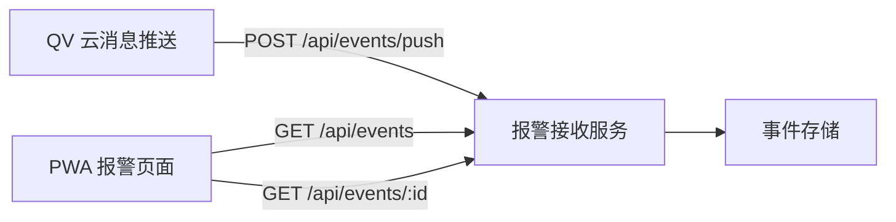

# PWA 报警消息模块技术方案

## 1. 背景

当前 PWA 项目用于设备接入、设备查看、设备配置和云 API 调试。后续需要新增一个报警消息模块，用于接收来自 QV 云或其他服务器的 HTTP POST 推送消息，保存报警记录，并在 PWA 中展示。

参考资料位于：

```text
openapi_event doc/
```

相关文档说明了三类推送消息：

| command | 说明 |
| --- | --- |
| `message.device.alarm` | 设备报警消息 |
| `message.device.managed` | 托管设备消息 |
| `message.device.cancelManaged` | 取消托管设备消息 |

## 2. 关键约束

PWA 是运行在浏览器中的前端应用，不能直接作为公网 HTTP 服务监听外部 POST 请求。因此报警模块需要拆分为两部分：

1. 服务端接收模块：提供公网 HTTP POST 接口，接收并保存推送消息。
2. PWA 展示模块：通过 HTTP API 查询服务端保存的报警记录，并在页面中展示。

整体架构如下：



## 3. 推荐技术方案

### 3.1 服务端

在当前仓库中新增一个轻量后端模块：

```text
server/
```

推荐技术栈：

| 项目 | 方案 |
| --- | --- |
| Runtime | Node.js |
| Web 框架 | Express 或 Fastify |
| 存储 | SQLite |
| 部署 | Docker Compose |
| 反向代理 | Nginx |

SQLite 适合当前阶段，部署简单，便于跟随 Docker volume 持久化。后续如果报警量较大，可以平滑迁移到 PostgreSQL 或 MySQL。

### 3.2 前端

在现有 React + MUI PWA 中新增报警页面：

```text
/alarms
```

并在底部导航中新增“报警”入口。

建议新增文件：

```text
src/pages/AlarmListPage.tsx
src/pages/AlarmDetailDialog.tsx
src/api/event-api.ts
src/types/event.ts
```

## 4. 服务端接口设计

### 4.1 接收推送消息

```http
POST /api/events/push
Content-Type: application/json
```

请求体为 QV 云推送的原始 JSON。

报警消息示例：

```json
{
  "command": "message.device.alarm",
  "payload": {
    "list": [
      {
        "deviceName": "deviceName01",
        "deviceId": "tdksxxx",
        "alarmEvent": 2,
        "alarmEventName": "detection",
        "alarmId": "2",
        "alarmTime": "2026-04-30 05:45:13",
        "alarmUniqueId": 386231564091248640,
        "alarmState": 0,
        "alarmIfRecord": 1,
        "recordResUrl": "https://address",
        "recordSubResUrl": "https://address"
      }
    ]
  }
}
```

成功响应：

```json
{
  "code": 0
}
```

处理规则：

| command | 处理方式 |
| --- | --- |
| `message.device.alarm` | 拆分 `payload.list`，每条报警保存为一条事件记录 |
| `message.device.managed` | 保存托管消息和设备列表 |
| `message.device.cancelManaged` | 保存取消托管消息和设备列表 |
| 未知 command | 保存原始报文，标记为未知消息 |

### 4.2 查询报警列表

```http
GET /api/events
```

查询参数：

| 参数 | 类型 | 说明 |
| --- | --- | --- |
| `page` | number | 页码，默认 `1` |
| `pageSize` | number | 每页数量，默认 `20` |
| `offset` | number | 可选兼容参数，SQL 偏移量 |
| `limit` | number | 可选兼容参数，SQL 查询数量 |
| `deviceId` | string | 按设备 ID 过滤 |
| `command` | string | 按消息类型过滤 |
| `alarmState` | number | 按报警状态过滤 |
| `keyword` | string | 按设备名、设备 ID、报警名搜索 |
| `startTime` | string | 报警开始时间 |
| `endTime` | string | 报警结束时间 |

对外接口优先使用 `page` / `pageSize`，更符合前端分页组件的使用习惯。服务端内部转换为 `offset` / `limit` 执行 SQL 查询，并可兼容直接传入 `offset` / `limit` 的调用方式。

响应示例：

```json
{
  "items": [],
  "page": 1,
  "pageSize": 20,
  "total": 0
}
```

### 4.3 查询报警详情

```http
GET /api/events/:id
```

用于展示单条报警详情和原始报文。

### 4.4 查询统计信息

```http
GET /api/events/stats
```

建议返回：

```json
{
  "total": 120,
  "today": 18,
  "byAlarmState": {
    "0": 5,
    "1": 8,
    "2": 2,
    "3": 0
  },
  "byCommand": {
    "message.device.alarm": 110,
    "message.device.managed": 7,
    "message.device.cancelManaged": 3
  }
}
```

统计接口按维度动态分组，前端根据 `alarmState` 映射文案渲染，不依赖硬编码字段名。

### 4.5 健康检查

```http
GET /api/events/health
```

响应示例：

```json
{
  "status": "ok"
}
```

### 4.6 删除报警记录

```http
DELETE /api/events/:id
```

第一阶段可以不做批量删除，避免误操作。

### 4.7 路由注册顺序

服务端需要注意固定路径必须先于动态路径注册，避免 `stats`、`health` 被 `:id` 捕获。

建议顺序：

```text
GET    /api/events/stats
GET    /api/events/health
GET    /api/events
GET    /api/events/:id
POST   /api/events/push
DELETE /api/events/:id
```

## 5. 数据模型

### 5.1 TypeScript 类型

```ts
export type EventCommand =
  | 'message.device.alarm'
  | 'message.device.managed'
  | 'message.device.cancelManaged'
  | 'unknown'

export interface AlarmEventRecord {
  id: string
  command: EventCommand
  deviceId?: string
  deviceName?: string
  alarmEvent?: number
  alarmEventName?: string
  alarmId?: string
  alarmTime?: string
  alarmUniqueId?: string
  alarmState?: number
  alarmIfRecord?: number
  recordResUrl?: string
  recordSubResUrl?: string
  managedMessageId?: string
  managedState?: string
  receivedAt: string
  rawPayload: string
}
```

说明：

1. `rawPayload` 对应 SQLite 的 `TEXT` 字段，前端详情弹窗可直接作为原始 JSON 字符串展示。
2. `managedMessageId` 对应托管/取消托管消息顶层 `id`，按 `uint64` 处理并转换为字符串。
3. `managedState` 对应托管/取消托管消息的 `payload.state`。
4. `alarmUniqueId` 在文档中是 `uint64`，前端 JavaScript 不能安全承载所有 64 位整数，所以保存和传输时应转为字符串。

### 5.2 SQLite 表结构

```sql
CREATE TABLE IF NOT EXISTS events (
  id TEXT PRIMARY KEY,
  command TEXT NOT NULL,
  device_id TEXT,
  device_name TEXT,
  alarm_event INTEGER,
  alarm_event_name TEXT,
  alarm_id TEXT,
  alarm_time TEXT,
  alarm_unique_id TEXT,
  alarm_state INTEGER,
  alarm_if_record INTEGER,
  record_res_url TEXT,
  record_sub_res_url TEXT,
  managed_message_id TEXT,
  managed_state TEXT,
  received_at TEXT NOT NULL,
  raw_payload TEXT NOT NULL
);

CREATE INDEX IF NOT EXISTS idx_events_received_at ON events(received_at);
CREATE INDEX IF NOT EXISTS idx_events_device_id ON events(device_id);
CREATE INDEX IF NOT EXISTS idx_events_alarm_unique_id ON events(alarm_unique_id);
CREATE INDEX IF NOT EXISTS idx_events_managed_message_id ON events(managed_message_id);
CREATE INDEX IF NOT EXISTS idx_events_command ON events(command);
```

如果后续对已有数据库做升级，则通过迁移脚本补充字段：

```sql
ALTER TABLE events ADD COLUMN managed_message_id TEXT;
ALTER TABLE events ADD COLUMN managed_state TEXT;
CREATE INDEX IF NOT EXISTS idx_events_managed_message_id ON events(managed_message_id);
```

去重策略：

```text
message.device.alarm 优先使用 alarmUniqueId 去重。
如果没有 alarmUniqueId，则使用 command + deviceId + alarmId + alarmTime + alarmState 作为弱去重条件。
message.device.managed 使用 command + managedMessageId + deviceId 去重。
message.device.cancelManaged 使用 command + managedMessageId + deviceId 去重。
unknown 使用 command + 整包 JSON hash 去重。
```

`alarmUniqueId` 精度保护：

```ts
function safeAlarmUniqueId(value: number | string): string {
  if (typeof value === 'string') return value
  if (value > Number.MAX_SAFE_INTEGER) {
    console.warn(`alarmUniqueId exceeds safe integer: ${value}`)
  }
  return String(value)
}
```

如果 QV 推送的 `alarmUniqueId` 实际存在超过 `Number.MAX_SAFE_INTEGER` 的情况，标准 `JSON.parse` 在解析阶段可能已经丢失精度。更严格的实现应保留原始 body，或使用支持大整数的 JSON 解析方案。

## 6. 前端页面设计

### 6.1 路由

新增路由：

```tsx
<Route path="/alarms" element={<AlarmListPage />} />
```

当前项目使用：

```tsx
<BrowserRouter basename="/monitor">
```

因此生产访问路径为：

```text
/monitor/alarms
```

### 6.2 页面结构

报警页面建议包含：

1. 顶部 AppBar：标题、刷新按钮、筛选入口。
2. 统计区：今日报警数、总报警数、按报警状态分组、按消息类型分组。
3. 筛选区：设备、报警类型、报警状态、时间范围。
4. 列表区：按接收时间倒序展示报警记录。
5. 详情弹窗：展示报警字段、资源链接和原始 JSON。

### 6.3 列表字段

| 字段 | 展示说明 |
| --- | --- |
| 设备名称 | 优先显示 `deviceName` |
| 设备 ID | 显示 `deviceId`，长 ID 省略中间部分 |
| 报警类型 | 显示 `alarmEventName`，没有时显示 `alarmEvent` |
| 报警状态 | 根据 `alarmState` 映射为状态文案 |
| 报警时间 | `alarmTime` |
| 接收时间 | `receivedAt` |

报警状态映射：

| alarmState | 文案 |
| --- | --- |
| `0` | 停止/离线 |
| `1` | 开始/在线 |
| `2` | 设备故障 |
| `3` | 硬盘满 |

### 6.4 刷新策略

第一阶段建议使用轮询：

```text
每 5 秒请求一次 /api/events?page=1&pageSize=20
```

后续如需实时性更强，可新增 SSE：

```http
GET /api/events/stream
```

### 6.5 外部资源 URL 安全渲染

`recordResUrl`、`recordSubResUrl` 属于外部输入。前端渲染为可点击链接时，需要校验协议并添加安全属性：

```ts
const SAFE_PROTOCOLS = ['https:', 'http:']

function isSafeUrl(url: string): boolean {
  try {
    const parsed = new URL(url)
    return SAFE_PROTOCOLS.includes(parsed.protocol)
  } catch {
    return false
  }
}
```

使用方式：

```tsx
{record.recordResUrl && isSafeUrl(record.recordResUrl) && (
  <a href={record.recordResUrl} target="_blank" rel="noopener noreferrer">
    查看录像/图片
  </a>
)}
```

### 6.6 本地开发代理

本地开发时，Vite dev server 和 `event-api` 分别运行在不同端口。建议在 `vite.config.ts` 的 `server.proxy` 中增加：

```ts
server: {
  proxy: {
    '/api/events': {
      target: 'http://localhost:3001',
      changeOrigin: true,
    },
  },
}
```

这样前端仍然请求同源 `/api/events`，由 Vite 转发到本地后端。

## 7. 部署方案

### 7.1 Docker Compose

现有 `docker-compose.yml` 已包含 `nginx` 和 `mediamtx`。建议新增 `event-api` 服务：

```yaml
event-api:
  build: ./server
  container_name: monitor-event-api
  volumes:
    - ./event-data:/app/data
  restart: unless-stopped
  healthcheck:
    test: ["CMD-SHELL", "wget -qO- http://localhost:3001/api/events/health || exit 1"]
    interval: 30s
    timeout: 5s
    retries: 3
```

并让 Nginx 转发 `/api/events/` 到该服务。

### 7.2 服务端 Dockerfile

建议新增 `server/Dockerfile`：

```dockerfile
FROM node:20-alpine
WORKDIR /app
COPY package.json package-lock.json ./
RUN npm ci --omit=dev
COPY . .
EXPOSE 3001
CMD ["node", "index.js"]
```

`server/package.json` 建议包含：

```json
{
  "dependencies": {
    "better-sqlite3": "^11.0.0",
    "cors": "^2.8.5",
    "express": "^4.18.0",
    "morgan": "^1.10.0",
    "uuid": "^10.0.0"
  }
}
```

注意：`better-sqlite3` 是原生模块，使用 Alpine 镜像时可能涉及编译依赖。如果构建遇到原生依赖问题，可以改用非 Alpine 的 `node:20-bookworm-slim`，或在 Alpine 镜像中补充构建工具链。

### 7.3 Docker 内 Nginx

在 `nginx.conf` 中新增：

```nginx
location /api/events/ {
  proxy_pass http://event-api:3001/api/events/;
  proxy_http_version 1.1;
  proxy_set_header Host $host;
  proxy_set_header X-Real-IP $remote_addr;
  proxy_set_header X-Forwarded-For $proxy_add_x_forwarded_for;
  proxy_set_header X-Forwarded-Proto $scheme;
}
```

注意：该 `location` 块需要放在 `location /` 之前，确保 API 请求不会被 SPA catch-all 拦截。API 响应不应套用静态资源缓存规则。

### 7.4 外层 Nginx

如果生产环境仍通过外层 `app.conf` 代理到 Docker Nginx，则新增：

```nginx
location /api/events/ {
  proxy_pass http://127.0.0.1:8081/api/events/;
  proxy_set_header Host $host;
  proxy_set_header X-Real-IP $remote_addr;
  proxy_set_header X-Forwarded-For $proxy_add_x_forwarded_for;
  proxy_set_header X-Forwarded-Proto $scheme;
}
```

注意：该 `location` 块同样需要放在 `location /` 之前。

QV 云侧配置的报警回调地址建议为：

```text
https://app.clouduse01.com/api/events/push
```

如果启用 callback token：

```text
https://app.clouduse01.com/api/events/push?token=xxxx
```

## 8. 安全设计

报警推送接口是公网入口，至少需要以下保护：

| 项目 | 建议 |
| --- | --- |
| 认证 | 生产优先使用 `X-Webhook-Token` Header；query token 仅建议用于联调 |
| Body 大小 | 限制为 `1mb` |
| 日志 | 使用 morgan 记录来源 IP、command、处理耗时、成功/失败状态码 |
| 去重 | 对 `alarmUniqueId` 或消息 ID 建唯一约束 |
| 错误处理 | 解析失败时返回非 0 code，并写错误日志 |
| 密钥 | token 通过环境变量注入，不写死到前端 |

环境变量建议：

```text
EVENT_API_PORT=3001
EVENT_DB_PATH=/app/data/events.sqlite
EVENT_WEBHOOK_TOKEN=replace-me
```

服务端中间件建议：

```ts
import cors from 'cors'
import morgan from 'morgan'

app.use(morgan(':remote-addr :method :url :status :response-time ms'))

app.use(cors({
  origin: process.env.NODE_ENV === 'production'
    ? false
    : 'http://localhost:5173',
}))
```

如果本地开发已通过 Vite proxy 访问 `/api/events`，CORS 不是主链路必需项，但保留该配置有利于直接调试 `event-api`。

## 9. 联调方式

### 9.1 curl 模拟报警

```bash
curl -X POST "http://localhost:3001/api/events/push?token=replace-me" \
  -H "Content-Type: application/json" \
  -d '{
    "command": "message.device.alarm",
    "payload": {
      "list": [
        {
          "deviceName": "deviceName01",
          "deviceId": "tdksxxx",
          "alarmEvent": 2,
          "alarmEventName": "detection",
          "alarmId": "2",
          "alarmTime": "2026-04-30 05:45:13",
          "alarmUniqueId": "386231564091248640",
          "alarmState": 1,
          "alarmIfRecord": 1,
          "recordResUrl": "https://address",
          "recordSubResUrl": "https://address"
        }
      ]
    }
  }'
```

预期响应：

```json
{"code":0}
```

### 9.2 查询报警列表

```bash
curl "http://localhost:3001/api/events?page=1&pageSize=20"
```

### 9.3 使用现有 mock 脚本

资料目录下已有：

```text
openapi_event doc/mock_third_party.py
```

该脚本当前只打印收到的 POST 报文。后续实现正式 `event-api` 后，可以保留它作为对照工具，并改造成两种模式：

```text
默认模式：作为 QV 云的 mock，接收并打印推送。
转发模式：将收到的报文转发到本地 event-api。
```

建议命令：

```bash
python "openapi_event doc/mock_third_party.py" --forward http://localhost:3001/api/events/push
```

## 10. 第一阶段开发范围

建议第一阶段完成以下内容：

1. 新增 `server/` 报警接收服务。
2. 实现 `POST /api/events/push`。
3. 实现 SQLite 持久化。
4. 实现 `GET /api/events`、`GET /api/events/:id`、`GET /api/events/stats`、`GET /api/events/health`。
5. PWA 新增 `/alarms` 页面。
6. 底部导航新增“报警”入口。
7. Vite 开发代理接入 `/api/events`。
8. Docker Compose 和 Nginx 接入 `/api/events/`。
9. 使用 curl 完成端到端模拟联调。

## 11. 后续扩展

后续可以继续增强：

1. 报警已读/未读状态。
2. 报警处理备注。
3. 报警导出 CSV。
4. SSE 实时推送。
5. 多用户权限。
6. 按设备聚合报警趋势。
7. 点击报警资源 URL 直接查看图片或录像。
8. 与现有设备详情页联动，支持从设备详情页查看该设备报警历史。
